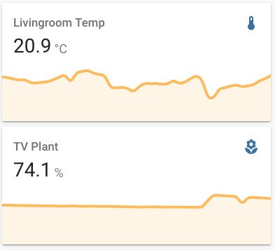

# Chirp I2C MQTT bridge
Add-on to [Home Assistant](
  https://www.home-assistant.io/) on a Raspaberry Pi.

Reads temperature and soil moisture using the i2c sensor [Chirp](
  https://www.tindie.com/products/miceuz/i2c-soil-moisture-sensor/) ([github](
  https://github.com/Miceuz/i2c-moisture-sensor)). It
publishes the measurements
to an MQTT topic.

## Installation
You need the following:

*   Raspberry Pi with [Hass.io](
      https://www.home-assistant.io/hassio/installation/) installed.
*   Add-ons installed
    *    [MQTT Broker](https://www.home-assistant.io/docs/mqtt/broker/)
    *    [Samba share](
           https://github.com/home-assistant/hassio-addons/tree/master/samba)
*   The Chirp i2c sensor

### 1. Connect Chirp Sensor 
Connect the sensor to the raspberry pi [I2C pins](
  https://pinout.xyz/pinout/i2c).

### 2. Enable raspberry pi i2c
This opens up the /dev/i2c-1 path on the Raspberry Pi. This is how the addon
interacts with the I2C pins, and is not enabled by default.

The official hass.io instructions uses a USB stick upon boot: [Enable I2C on Home Assistant](
  https://www.home-assistant.io/hassio/enable_i2c/). This did however NOT WORK for me. I had
to do it manual through:

    ssh -p 22222 root@hassio.local
    login
    ls /dev/i2c-*  # doesn't show any.
    vi /mnt/boot/config.txt

Change the config.txt file directly:

    dtparam=i2c1=on
    dtparam=i2c_arm=on

Reboot.

Verify by looking ro /dev/i2c-1:

    ssh -p 22222 root@hassio.local
    login
    ls /dev/i2c-*  # doesn't show any.

### 3. Install the Addon
git clone repository.
Copy the addon into Home Assistant Addon folder using samba share. On Mac OS X this
looked like:

    rsync -r -v addon-chirp2mqtt/* /Volumes/addons/chirp2mqtt/

Go to your Home Assistant Add-On Store and click refresh. The Chirp I2C Add-on
should be found under "Local Add-ons". Click Install.

TODO: See if this can be added to Home Assistant Add-on store.

Configure addon setting the options.json, particularly the mqtt broker
username and password:

        mqtt_address: 'mqtt://homeassistant'
        mqtt_username: mqtt
        mqtt_password: <password>

Start the Add-on.

The [Developer Tools Add-On](
    https://www.home-assistant.io/docs/tools/dev-tools/) has an MQTT
inspection that is useful to see what's published on MQTT. 

### 4. Configure Home Assistant Sensor
The sensor can then be added to Home Assistant as an MQTT sensor. Update
configuration.yaml. Example:

    # Chirp Soil sensor
    sensor plant_temp:
      platform: mqtt
      name: "Plant Temp"
      state_topic: "chirp/c01"
      value_template: "{{ value_json.temp }}"
      device_class: "temperature"
      unit_of_measurement: "°C"
    
    sensor plant_moist:
      platform: mqtt
      name: "Plant Moisture"
      state_topic: "chirp/c01"
      value_template: "{{ value_json.moist_percent }}"
      device_class: "humidity"
      unit_of_measurement: "%"
  

## Options
All supported options.

| Option          | Type | Default |      |
|-----------------|----------------|------------|--------------------------|
| mqtt_address    |  URL | mqtt://homeassistant | Address to mqtt broker.  |
| mqtt_username   |  str | mqtt | Username to access mqtt broker |
| mqtt_password   |  str |  | Password to mqtt username.  |
| mqtt_topic      |  str | chirp/c01 | Topic to post measurments  |
| i2c_addr        |  int | 32 | i2c address, chirp defaults to 0x20. This can be seen on startup. |
| moist_min       |  int | 222 | Moist calibration minimum uS/cm2 |
| moist_max       |  int | 577 | Moist calibration maximum uS/cm2 |
| temp_offset     |  int | 0 | Calibration offset for temperature in Celsius |
| read_period_sec |  int | 600 | Poll frequency in seconds |

## Calibrate the sensor
The sensor measures capacity in uS/cm2, to translate this to a 0-100%
percentage moisture level you need to find the min and max capacity.

Follow instructions in [chirp-rpi calibration](
  https://github.com/ageir/chirp-rpi#calibration)
