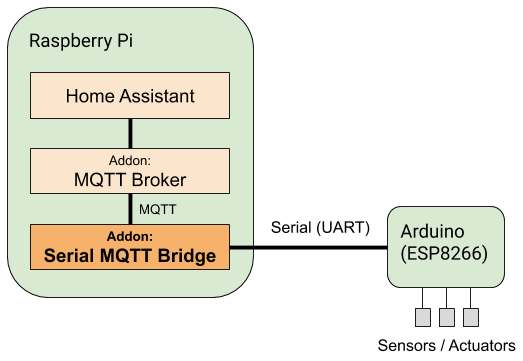
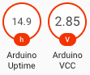

# Serial MQTT bridge
Add-on to [Home Assistant](https://www.home-assistant.io/).

Gateway between UART Serial port and MQTT. Useful to communicate to an [Arduino](
https://www.arduino.cc/), like [ESP8266](https://de.wikipedia.org/wiki/ESP8266).
Both reads and writes to the serial port by publish and subscribe to MQTT.

Uses a JSON based serial protocol with one message per line. Interface is
inspired by [serial2mqtt](https://github.com/vortex314/serial2mqtt).

Example setup with a Raspberry Pi running Hass.io and Home Assistant and a
ESP8266 connected with serial, that communicates with some sensors.

Screenshot from Home Assistant using the Arduino Test Bed status.

# Installation

1.   Install [MQTT broker addon](
       https://www.home-assistant.io/docs/mqtt/broker/).
     Create a user mqtt that can connect to this broker. Set mqtt_username
     and mqtt_password.
1.   Connect device to serial port. An Arduino or ESP8266 can be connected
     using USB to your Raspberry Pi. Set serial_port, for Raspberry Pi USB,
     use "/dev/ttyUSB0". Set the right serial_baud rate, default ESP8266
     74880 is the default.
1.   Start.

You may use the arduino_testbed sketch to test the communication.

# Config

| Option             | Type | Default |      |
|--------------------|----------------|------------|--------------------------|
| mqtt_address       |  URL | mqtt://homeassistant | Address to mqtt broker.  |
| mqtt_username      |  str | mqtt | Username to access mqtt broker |
| mqtt_password      |  str |  | Password to mqtt username.  |
| mqtt_publish_topic |  str | arduino/read | Base MQTT topic to publish serial messages to. The message itself may contain a sub-topic. |
| mqtt_publish_qos |  int | 0 | Default MQTT QoS if the message has not set one. |
| mqtt_publish_retain |  bool | false | Default MQTT message retain field if serial message has not set one. |
| mqtt_subscribe_topic |  str | arduino/write | Base MQTT topic to subscribe. Messages posted here are forwarded to the serial port. |
| serial_port |  str | /dev/ttyUSB0 | Serial port to connect to. Raspberry PI USB is usually /dev/ttyUSB0, the RPI UART interface is usually found on /dev/ttyS0 |
| serial_baud |  int | 74880 | Baud rate to use for serial port. |

# Interface
The protocol on the serial port uses JSON with one line per message.

## Read from Serial
The Arduino (or serial device) has to send a JSON message with the fields:
*   `topic` - the sub-topic to MQTT. All messages are posted under config mqtt_publish_topic.
    if not set, 'data' is used as default.
*   `msg` - Message payload, may be a string or a JSON sub-message.
*   `qos` - Optional MQTT QoS of message to publish.
*   `retain` - Optional bool to set retention of MQTT message.

Example:

    {"topic": "bresser/ch2", "msg": {"battery": 1, "temp": 249, "humidity":29}}

This message will be published on `areduino/read/bresser/ch2` with the default
config for `mqtt_publish_topic`.

Any serial output from the arduino that is not valid json ends up in
`$mqtt_publish_topic/log`, default `arduino/read/log`.

## Write to Serial
Any message to the topic `mqtt_subscribe_topic` or sub-topics will be written
as a one-line JSON serial message with the fields:

*   `topic` - sub MQTT topic.
*   `msg` - MQTT Payload message, string or JSON.

Example:

    {"topic": "rcswitch/ch2", "msg": {"state": "ON"}}

# Arduino Test Bed
To test this addon, you can upload the `arduino_testbed` sketch to your connected
NodeMCU (ESP8266). This sends a status message every 10 seconds containing uptime and
CPU voltage.

To hook the status up to Home Assistant sensors, you can add this to your configuration.json

    sensor arduino_uptime:
      platform: mqtt
      name: Arduino Uptime
      state_topic: "arduino/read/status"
      value_template: "{{ value_json.uptime_ms / 1000 / 3600 | round(1) }}"
      device_class: "timestamp"
      unit_of_measurement: h
    
    sensor arduino_vcc:
      platform: mqtt
      name: Arduino VCC
      state_topic: "arduino/read/status"
      value_template: "{{ value_json.vcc | round(2) }}"
      device_class: "battery"
      unit_of_measurement: V
